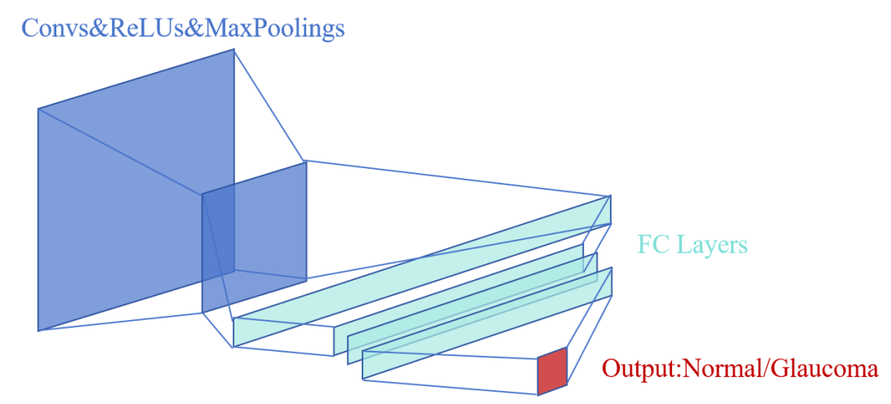

# EyeNet: A Convolutional Neural Network for Glaucomatous Fundus Lesion Detection

Glaucoma, an eye disease that causes irreversible vision loss, poses a major threat to human health worldwide. It is estimated that by 2020, more than 11 million people worldwide will be blinded by glaucoma. Given its lack of early symptoms, early diagnosis is critical to prevent vision damage. However, the lack of specialized ophthalmologists, especially in remote areas, limits early screening and treatment of glaucoma. To address this problem, this study proposes **EyeNet**, a convolutional neural network (CNN)-based glaucomatous fundus lesion detection system aimed at assisting physicians in more efficient glaucoma screening.

## Data and Methodology
We utilized the glaucoma fundus lesion image dataset obtained from Kaggle and performed data enhancement via OpenCV to pinpoint the ROI, which were used as model inputs. The constructed EyeNet model combines multi-layer convolution, pooling, and fully connected layers to extract image features and perform classification. 

## Training and Results
The model was trained using the `BCEWithLogitsLoss` loss function and the `Adam` optimizer, and after 140 generations of iterations, EyeNet achieved a high accuracy of **96.59%** on the test set. Visualization analysis further confirmed the model's ability to effectively identify key features of the fundus optic disc. 

 
The team then tested BEH-179, a normal fundus image from the dataset, using a pre-trained model with 96.59% accuracy. The output tensor of each convolutional layer was converted into an image for visualization and analysis, and the team found that the model effectively learned multiple features in the fundus optic disc and output the correct result "glaucoma negative". 
                        

 
Optic nerve, vitreous and fundus optic disc features are extracted as shown in Fig.
## Innovation and Impact
The innovation of this study is the application of deep learning techniques to the automated diagnosis of glaucoma, which optimizes the model inputs through data augmentation techniques and significantly improves the training efficiency and diagnostic accuracy. Although the model needs further validation and optimization in practical clinical applications, its potential to improve the early diagnosis rate of glaucoma is obvious, and it is expected to provide effective technical support to alleviate the problem of glaucoma screening in areas with insufficient medical resources.
 
## How to use?
### GPU check
Terminal: `python testGPU.py` 
If the output is like: 
2.3.0+cu118 
11.8 
True 
,the GPU is available. (the torch and CUDA version NOT have to be the same) 

### Train the model
Make sure the dataset is in ./data, and check the modules are all installed correctly. 
The dataset tree should be like: 
 
data 
  |---archive 
         |---test 
              |---0 
              |---1 
         |---train 
              |---0 
              |---1 
         |---val 
              |---0 
              |---1 
Then, if it's the first time that you train this model, you should open train.py, find `train(m, n)` in the last line and change it to `train(0, n)`.(recommendation: n=10) 
Therefore, if it's NOT the first time(you have the pre-trained model "check_point.pth"), change `train(m, n)` into `train(pre_epochs, end_epochs)`. 

Lastly, after all these works are done,  
Terminal: `python train.py` 

### Use the model to diagnose
Terminal: `python diagnosis.py` 
Then it will randomly choose 8 figs from ./data/archive/val, and it's four pictures from val/1 and another four from val/0. 
